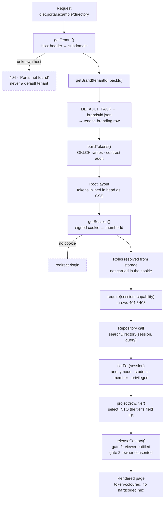

# Architecture

For the engineer who inherits this. Everything below is true of the code as
it stands; where something is designed but not built, it says so.

---

## 1. The load-bearing decisions

Seven. Each one is here because of a specific failure mode, and each is
expensive to reverse later. Everything else in the codebase is swappable.

### Row-level security on `app.tenant_id`, not application-code filtering

`withTenant()` (`src/lib/db/client.ts`) opens an interactive transaction,
issues `SET LOCAL app.tenant_id = '<uuid>'`, and runs the callback's queries
inside it. Every tenant-scoped table has a policy checking that variable.

`SET LOCAL` rather than plain `SET` is not a style choice. With a connection
pool, a plain `SET` persists on the connection and leaks the tenant context
into whichever request picks that connection up next — the worst possible
version of this bug, because it is intermittent and load-dependent.

**What it prevents:** one forgotten `WHERE tenant_id = ?` becoming a
cross-college data leak. Application filtering is one layer, and one layer of
tenant isolation is not a layer of tenant isolation. The repository applies
the same rules in code; Postgres applies them again underneath.

The tenant id is interpolated into raw SQL because `SET LOCAL` does not accept
a bind parameter. `withTenant()` therefore rejects anything that is not a
36-character UUID before it builds the statement.

### One `members` table with a status enum, not separate student and alumni tables

One person, one row, keyed on roll number:

```
unclaimed → invited → pending → active_student → active_alumni
```

plus `rejected`, `lapsed` and `deceased` as terminal states. `deceased`
suppresses all outreach and retains the record, which is the only humane
option and also the only one that survives a family member calling the office.

A final-year student becomes an alumnus. Same person, same roll number, same
mentorship history, same connection graph.

**What it prevents:** every graduating batch becoming a manual data migration,
and every directory query becoming a union. The annual transition is
`rollover_batch(tenant, batch, dry_run)` in the migration — admin-triggered
with a dry-run preview, never automatic, because result publication dates slip
and an automatic promotion on a fixed date will be wrong most years.

Roles are a separate, additive set (`member_roles`), independent of status. A
person can be `alumni` + `faculty` + `hod` of CSE at once, and the grants are
the union.

### `degree_register` as the source of truth for verification

The college's authoritative record from the examinations branch: roll number,
name, branch, admission year, year of passing, for every graduate whether or
not they ever sign up. `matchClaim()` (`src/lib/verification/matcher.ts`)
scores a self-registration against candidate rows.

**What it prevents:** every registration being a human decision made against
no evidence, which is how an alumni cell of one person drowns in month two —
and how a directory fills with people who did not attend the college.

The matcher is pure, dependency-free and separately runnable
(`npm run check:matcher`). It scores roll number (0.6), name similarity by
token set with Levenshtein (0.3 / 0.18 / 0.05), department (±0.05 / −0.15) and
batch year (+0.05 / −0.2). Above `AUTO_APPROVE_AT` (0.9) it approves; above
`REVIEW_AT` (0.45) it queues; below that it rejects.

Two guards matter more than the thresholds:

- **Intake rejection.** A roll number that is not at least eight characters
  starting with two digits never reaches scoring. The competitor's queue
  contains a record with roll number `01`.
- **The ambiguity guard.** If the top two candidates are within 0.15 of each
  other, a human decides regardless of how high the top score is. Same-name
  cousins and twins in a cohort of 240 are not rare.

Both thresholds are provisional and must be retuned against the real register
when it arrives. The harness in `tests/matcher.manual.ts` is the place to do it.

### `member_contacts` as a separate table

Email, mobile, LinkedIn, GitHub, portfolio, address and the visibility setting
live in their own table, keyed one-to-one on `member_id`. `members` holds none
of them.

**What it prevents:** field-level access control degrading into "did whoever
wrote this serializer remember to delete the email key". It becomes a question
of which table you joined. Adding a column to `members` cannot widen a
directory response, because responses are built by selecting *into* a fixed
projection (`src/lib/members/projection.ts`) rather than by fetching a row and
removing keys.

The fixture layer mirrors the split: `SeedMember.privateContact` is never
returned by any repository function without passing through
`releaseContact()`.

### Email OTP as the primary credential

No passwords. A six-digit code from `randomBytes`, HMAC-hashed with the email
as salt, single-use, attempt-capped, ten-minute TTL
(`src/lib/auth/session.ts`).

**What it prevents:** password reuse across a population that will reuse
passwords, and a credential-stuffing surface on a database of 8,000 people who
last logged in three years ago. Mobile is captured and verified at profile
completion and used for recovery and WhatsApp — never as the primary login,
because SIM swap in this market is not a theoretical attack.

The OTP store is currently an in-process `Map`. That is correct for fixture
mode and a single dev server, and deliberately wrong for production: two app
instances must not disagree about whether a code has already been used. The
Redis implementation goes behind the same interface.

### `ap-south-1` residency

Postgres and object storage stay in India.

**What it prevents:** the entire cross-border-transfer chapter of the DPDP
Act. Not needing an answer is cheaper than having one. This constrains hosting
choices and it is the reason `.env.example` pins `AWS_SES_REGION` and
`S3_REGION`.

### WhatsApp as the real communications channel

Email open rates on Indian alumni lists collected over a decade are poor.
Flows are designed assuming WhatsApp is where a message actually lands; email
is the credential channel and the formal record.

**What it prevents:** building an engagement product on a channel nobody
reads, then concluding the alumni are disengaged. Nothing is wired yet — the
provider account is an open dependency — but `member_contacts.whatsapp_opt_in`
exists from the first migration, and consent for it is recorded separately
from email consent.

---

## 2. Request lifecycle

Every page render walks the same path. Nothing about it is cacheable at the
CDN, which is correct — almost nothing in this app is public.



Four things about that path are worth stating explicitly.

**Branding is resolved before the session.** The layout needs colours before it
knows who is looking, so branding is read outside RLS. That is safe because
branding is tenant *configuration*, not member data, and the tenant was
already established from the request host.

**Tokens are inlined, not linked.** A stylesheet request would give one frame
of default branding before the real palette arrived. On a white-label portal
that does not read as loading; it reads as a broken site, and it is the first
thing a college notices. The cost is that every page is dynamic.

**Hiding a link is not authorisation.** `src/lib/navigation.ts` derives the
menu from capabilities so a link that would 403 is never rendered — a portal
where half the links fail teaches users the product is broken. But every route
still guards itself server-side. The navigation filter is presentation.

**Tenant resolution is a cached function, not middleware.** `getTenant()` is
wrapped in React's `cache()`, so the layout, the metadata function and any
component that asks all get one resolution per request. There is no
`middleware.ts`, and there does not need to be.

---

## 3. The fixture / database seam

`src/lib/config.ts` resolves `DATA_MODE` to `db` when `DATABASE_URL` is set and
`fixture` otherwise, and `DATA_MODE` can override that explicitly.

Fixture mode is not a toy and not a mock. It is:

- how the product is demonstrated to a college that has not signed anything;
- how the whole UI stays reviewable while the degree register is still stuck
  in the examinations branch — the longest-lead-time dependency on the project;
- how the permission suite will run in CI without a container.

The dataset is generated from a fixed seed (`mulberry32(20260817)`) so the
portal looks identical on every machine and every restart. A demo where the
numbers move between refreshes reads as broken, and a screenshot in a proposal
has to still be true next week. "Now" is pinned to `SEED_NOW`.

The data is shaped to be awkward deliberately: profile completeness decays
with distance from graduation, so a 2013 batch is mostly names with nothing
attached; register spellings differ from portal spellings in four separate
styles; two alumni share a name, branch and year; 12% of alumni are abroad so
FCRA segregation has something to segregate; and 620 of the 834 register rows
have no account at all, which is what the file looks like in month one.

### Where the seam actually is, today

Honest version, because this is the thing most likely to mislead:

| Module | `fixture` | `db` |
|---|---|---|
| `src/lib/tenant.ts` | seeded tenants, then any pack in `brands/` | `prisma.tenant.findUnique` by subdomain |
| `src/lib/branding/resolve.ts` | pack file only | pack file + `tenant_branding` row |
| `src/lib/auth/session.ts` | in-process OTP store, fixture member lookup | not implemented |
| `src/lib/audit/log.ts` | in-memory ring buffer, 200 entries | `prisma.auditLog.create` |
| `src/lib/data/repo.ts` | **the only implementation** | **not implemented** |

`repo.ts` imports the seed directly and does not branch on `DATA_MODE`.
Turning on a database today gives you Postgres-backed tenants and branding and
a fixture-backed directory. Writing the Prisma implementation behind the same
signatures — every one of which already takes a `Session` and applies
projection internally — is the first backlog item.

The interface is the important part and it is already right. Two properties
hold for every function in `repo.ts` and must keep holding:

1. **Authorisation happens in the repository, not in the page.** There is no
   argument a page could pass that would ask for more than its viewer is
   entitled to.
2. **Results are selected into a projection**, never fetched whole and
   trimmed.

---

## 4. Branding resolution and its caches

`getBrand()` runs on every server render, so it must not hit the database each
time. Three layers, in order:

1. **`cache()` from React** — dedupes within a single request. The root
   layout, `generateMetadata`, and any component that calls `getTenantBrand()`
   share one resolution.
2. **A process-level `Map` with a 60-second TTL** — survives across requests.
   Branding changes rarely and a stale minute is harmless, so this is a
   deliberately simple map rather than Redis. `invalidateBranding(tenantId)` is
   called on save, so an admin never sees their own change lag.
3. **The pack precedence chain**, resolved on a miss:
   `DEFAULT_PACK → brands/<id>.json → tenant_branding row → unsaved preview`.
   Each layer states only what it changes.

Two consequences to know about. The TTL map is per process, so on a multi-
instance deployment a publish invalidates one instance and the others catch up
within a minute — acceptable for colours, and the reason it is a minute and not
an hour. And `previewBrand()` runs the *same* `assemble()` as the renderer, so
what an administrator previews in the branding studio is byte-for-byte what
ships. That property is worth more than any optimisation that would break it.

Colour derivation itself is in `src/lib/branding/color.ts`: ramps are generated
in OKLCH rather than HSL because HSL lightness is not perceptually uniform, so
one algorithm cannot serve a navy and a yellow. Full detail in
[WHITE-LABEL.md](WHITE-LABEL.md).

---

## 5. Authorisation, in three layers

| Layer | File | Question it answers |
|---|---|---|
| Capability | `src/lib/auth/permissions.ts` + `guard.ts` | May this viewer perform this action at all? |
| Projection | `src/lib/members/projection.ts` | Which *fields* may this viewer receive? |
| Row-level security | `prisma/migrations/0001_init/migration.sql` | Which *rows* exist for this tenant? |

Capabilities are named (`member.export`, `directory.view.cgpa`), roles are
sets of capabilities, and a member holding several roles gets the union.
Adding a role is one table edit, not a grep for `role === 'admin'`.

`can()` returns false for any status outside `active_student` and
`active_alumni`. A `pending` member has no roles at all until verification
completes, so the check is structural rather than a special case.

Department scoping is separate and additive: `DEPARTMENT_SCOPED` lists the five
capabilities where holding the grant is not sufficient, and
`canInDepartment()` compares the grant's department against the target's. An
HOD of CSE holding `verification.review.department` is still refused an ECE
claim.

Projection tiers are `anonymous`, `student`, `member`, `privileged`. Contact
release is separate again, and needs **both** gates: the viewer entitled *and*
the owner consented via their visibility setting. Role alone is never
sufficient — that is DPDP purpose limitation, and it is the thing most
implementations get wrong.

One known mismatch: `tierFor()` promotes to `privileged` on
`directory.view.contact`, and `cgpa` / `placementStatus` / `rollNumber` live
only in that tier. The placement officer holds `directory.view.cgpa` and not
`directory.view.contact`, so the capability it is granted is unreachable
through the projection. It fails safe, and it is wrong. See
[SECURITY.md](SECURITY.md) §7.

The deliberate omissions are documented in the grants table and should not be
"fixed" without a decision. See [SECURITY.md](SECURITY.md) §3.

---

## 6. File map

```
brands/
  ifbash.json                  house brand — what the product wears
  diet.json                    first customer (colours PROVISIONAL)
  srivarsity.json              demo pack: maroon/gold, serif, rounded, lifted
  northgate.json               demo pack: monochrome, square, compact, flat

prisma/
  schema.prisma                mirrors the SQL; the SQL is the source of truth
  migrations/0001_init/        19 tables, RLS on 18, rollover_batch()

scripts/
  brand-new.ts                 scaffold a customer pack        (npm run brand:new)
  brand-check.ts               audit every pack, CI gate       (npm run brand:check)

src/lib/
  config.ts                    DATA_MODE, session and OTP constants, connection quotas
  tenant.ts                    Host → tenant, cached per request
  navigation.ts                capability-derived menus for member/admin/platform
  cn.ts, format.ts             class merge; en-IN dates, ₹ in lakhs, masking

  auth/permissions.ts          9 roles, 37 capabilities, department-scoped set
  auth/guard.ts                Session, can(), require*(), AuthzError
  auth/session.ts              signed cookie, OTP issue/verify, rate limiter

  members/projection.ts        tiers, project(), releaseContact(), requireDirectoryAccess()
  verification/matcher.ts      degree-register scoring — pure, no dependencies
  audit/log.ts                 logAudit(); never throws, always logs

  branding/pack.ts             the BrandPack Zod schema — the white-label contract
  branding/color.ts            OKLCH conversion, ramps, WCAG contrast, accessibleStop()
  branding/tokens.ts           pack → CSS custom properties, contrast audit
  branding/registry.ts         static pack imports; add a customer here
  branding/resolve.ts          cached resolution + previewBrand()
  branding/config.ts           the admin form subset (BrandingInput), narrower than the pack

  data/types.ts                the shapes the UI consumes — NOT Prisma row types
  data/seed.ts                 the fixture dataset and the nine demo accounts
  data/repo.ts                 the read layer; every function takes a Session

  db/client.ts                 prisma singleton, withTenant()

src/app/
  layout.tsx                   tenant → brand → tokens in <head> before first paint
  (app)/ (admin)/ (platform)/  route groups, each wrapping AppShell
  api/admin/branding/route.ts  GET current · POST publish · POST ?preview=1 · PUT import

src/components/                see docs/DESIGN-SYSTEM.md — that file is the contract

tests/
  matcher.manual.ts            nine hand-written claims   (npm run check:matcher)
  branding.manual.ts           eleven awkward seed colours (npm run check:branding)
```

---

## 7. What is not built

Stated here so nobody reads the above as a description of a finished system.
[BACKLOG.md](../BACKLOG.md) has the ordered list.

- **No mutations.** `repo.ts` is read-only. Nothing in the product persists a
  connection request, an RSVP, a job application, a verification decision or a
  profile edit. The only write path that exists end to end is the branding
  publish endpoint.
- **No database implementation of the repository.** See §3.
- **No auth route handlers.** The session and OTP primitives are written and
  unit-testable; the endpoints that call them are not.
- **No email, no queue, no storage, no payments, no WhatsApp.** Environment
  variables are declared in `.env.example` and nothing reads them yet. Bounce
  webhooks in particular are required rather than optional — without them a
  hard-bounced address stays in the directory forever and the list silently rots.
- **No tests.** Vitest is installed with zero test files; Playwright is not
  installed. The two highest-value suites are the RLS integration test and the
  per-role route matrix.
- **The initial migration has not been applied to a live Postgres.** Two
  statements are known to fail: `citext` columns without the extension, and a
  `CHECK` constraint containing a subquery, which Postgres does not permit.
- **`tenants` has no RLS policy.** Eighteen of nineteen tables do. The
  exception is deliberate — you must resolve a tenant before you can have a
  tenant context — but `CLAUDE.md` says "RLS on all" and that is one table
  optimistic.
